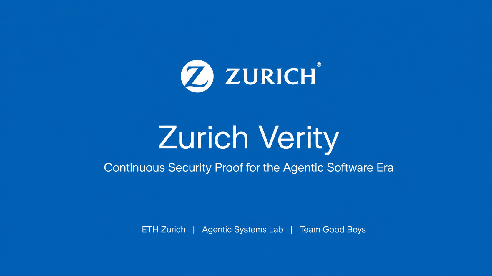
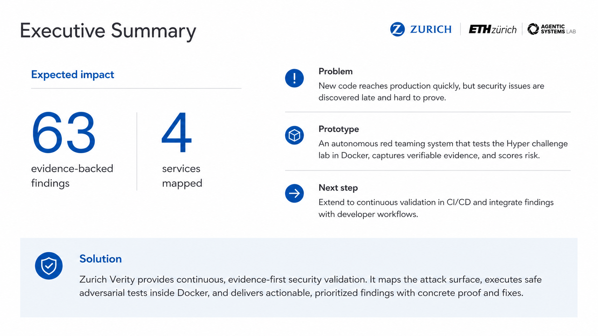
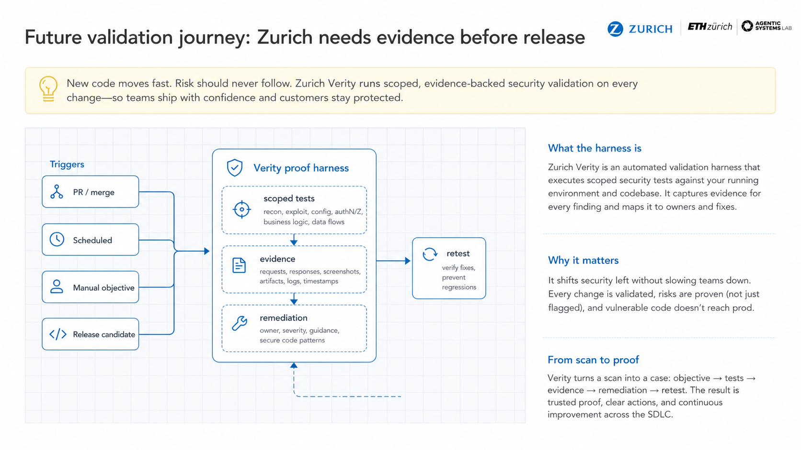
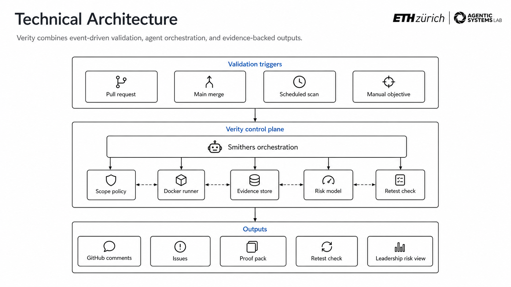
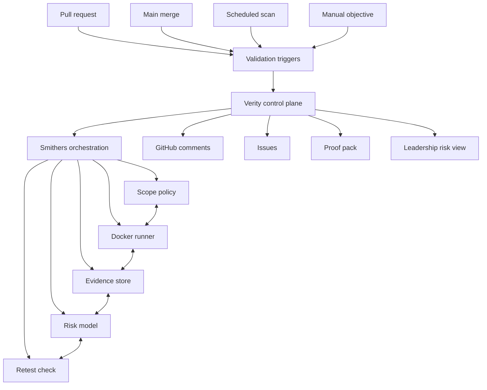

# Zurich Verity

Continuous security proof for the agentic software era.

Zurich Verity turns new code into scoped, Docker-isolated security validation with evidence, risk scoring, and owner-ready remediation. The operating principle is simple: security findings should be proven before risky code reaches production.

[Product Deck](assets/presentation/zurich-verity_good-boys.pdf) · [Technical Architecture](assets/technical/zurich-verity_good-boys_technical-summary.pdf) · [Video Transcript](assets/video/zurich-verity_good-boys-transcript.md) · [Live Prototype Proof](docs/live-prototype-proof.md) · [Full Assessment Report](reports/full-lab-security-assessment.md)



## What Zurich Verity Does

| Capability | Outcome | Location |
| --- | --- | --- |
| Docker validation harness | Active testing runs in an isolated runner with explicit scope controls. | [harness/](harness/) |
| Smithers orchestration | Autonomous validation follows a durable loop: scope, test, evidence, risk, remediation, retest. | [smithers/](smithers/) |
| Live PR workflow | Pull requests can be reviewed with agent analysis, Docker proof, PR comments, and remediation guidance. | [prototype/live-pr-review/](prototype/live-pr-review/) |
| Evidence-backed reporting | Findings include affected assets, proof, impact, and fix guidance. | [reports/](reports/) |
| Product and technical material | Product deck, architecture summary, slide images, and video transcript. | [assets/](assets/) |
| Production design notes | Architecture, security model, rollout plan, and business/technical overview. | [docs/](docs/) |

## Product Screens








## Why It Matters

Modern teams ship fast, but security validation often arrives late, as alerts, and without proof. Verity changes the operating model:

- **Evidence first:** every finding links to commands, responses, artifacts, timestamps, and reproduction steps.
- **Safe by design:** active testing runs inside Docker and is bound to explicit scope.
- **Developer-ready:** reports identify assets, owners, impact, fixes, and retest steps.
- **Production-shaped:** validation can be triggered from pull requests, main merges, scheduled scans, or manual objectives.
- **Risk-aware:** output is useful for engineering teams and leadership risk views.

## Working Prototype

Zurich Verity has been proven as a pull-request security review workflow:

- Demo repository: <https://github.com/ralfboltshauser/zurich-verity-demo>
- Proven PR: <https://github.com/ralfboltshauser/zurich-verity-demo/pull/3>
- Proven Action run: <https://github.com/ralfboltshauser/zurich-verity-demo/actions/runs/28005618755>
- Included implementation: [prototype/live-pr-review/](prototype/live-pr-review/)

The demo opens a PR with insecure code, runs Smithers on a self-hosted Ubuntu runner, uses a Docker-isolated Codex security analysis step, confirms the issue with a Docker proof harness, and writes an evidence-backed PR comment.

## Architecture



## Assessment Result

The validation environment contained four scoped services:

| Service | Role | Key result |
| --- | --- | --- |
| `customer-api.acme.local` | Customer API v2 | Critical unauthenticated credential exposure and admin takeover path. |
| `devops-hub.acme.local` | Gitea code hub | Anonymous repo access, weak developer credentials, secrets, keys, and internal topology exposure. |
| `apex-markets.acme.local` | E-commerce app | SQL injection, JWT bypasses, XXE, broken access control, XSS, coupon fraud, and data exposure. |
| `portal.acme.local` | Internal ops portal | Credential pivots and internal operational disclosure. |

The assessment produced **63 evidence-backed findings**. The curated high-impact breach path is documented in [reports/executive-summary.md](reports/executive-summary.md), and the complete assessment is preserved in [reports/full-lab-security-assessment.md](reports/full-lab-security-assessment.md).

## Run The Harness

The harness is designed so active testing runs inside Docker, not directly on the host.

```bash
cd harness/docker
docker compose run --rm verity-runner bash
```

Inside the runner, set the target proxy and scope file before executing validation commands:

```bash
export HTTP_PROXY=http://host.docker.internal:8081
export HTTPS_PROXY=http://host.docker.internal:8081
export VERITY_SCOPE=/workspace/harness/policies/scope.allowlist.example
```

The repository contains the harness foundation and workflow definition. Evidence and reports are stored under [reports/](reports/).

## Repository Layout

```text
zurich-verity/
  assets/               product deck, technical summary, slides, and video transcript
  docs/                 architecture, security model, rollout plan, and product overview
  harness/              Docker runner, scope policy, and execution guardrails
  smithers/             autonomous red-team workflow definition
  prototype/            working live PR review prototype and demo proof
  reports/              executive report, technical findings, full assessment, evidence notes
```

## Authors

- Ralf Boltshauser
- Samuel Huber
- Marco Pagano
