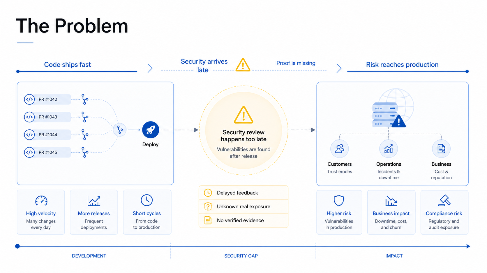
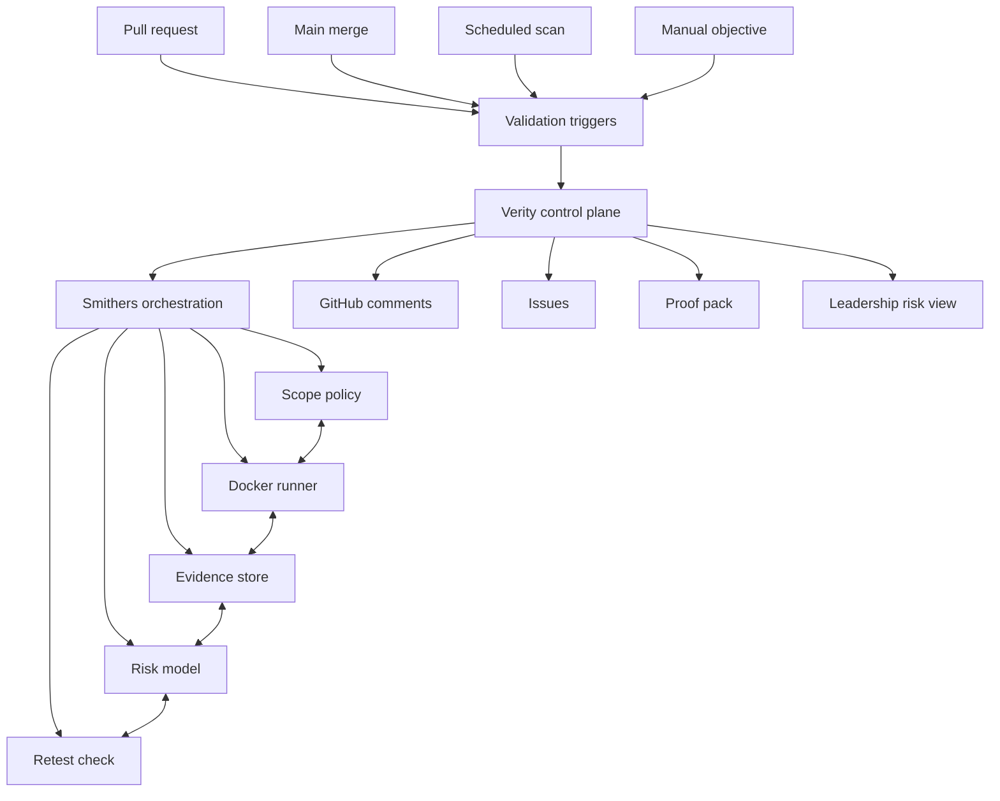

# Zurich Verity

Continuous security proof for the agentic software era.

Zurich Verity is the Hyper Challenge 2026 cyber prototype by **Good Boys**. It turns new code into scoped, Docker-isolated security validation runs with evidence, risk scoring, and owner-ready remediation. The core idea is simple: security findings should be provable before risky code ships.

[Submission Manifest](submission/manifest.md) · [Presentation PDF](submission/presentation/zurich-verity_good-boys.pdf) · [Technical Summary PDF](submission/technical/zurich-verity_good-boys_technical-summary.pdf) · [Video Transcript](submission/video/zurich-verity_good-boys-transcript.md) · [Live Prototype Proof](docs/live-prototype-proof.md) · [Full Lab Report](reports/full-lab-security-assessment.md)


## Submission Ready

| Deliverable | Status | Location |
| --- | --- | --- |
| GitHub repository package | Published on `main`. | [submission/manifest.md](submission/manifest.md) |
| Presentation video | Recorded and hosted externally. | <https://exploration.nbg1.your-objectstorage.com/zurich-verity_good-boys.mp4> |
| Transcript | Cleaned Markdown transcript plus SRT/VTT captions. | [submission/video/](submission/video/) |
| Business deck | Final PDF plus slide images. | [submission/presentation/](submission/presentation/) |
| Technical summary | Architecture PDF and source slide image. | [submission/technical/](submission/technical/) |
| Evidence package | Executive, technical, full, and per-finding reports. | [reports/](reports/) |

## What We Built

| Track | Purpose | Location |
| --- | --- | --- |
| Docker harness | Runs security validation from an isolated runner with explicit lab scope controls. | [harness/](harness/) |
| Smithers workflow | Durable autonomous red-team workflow: scope, test, evidence, risk, remediation, retest. | [smithers/](smithers/) |
| Live PR prototype | Working GitHub PR review demo with Smithers, Codex, Docker proof, PR comments, and remediation. | [prototype/live-pr-review/](prototype/live-pr-review/) |
| Evidence-backed reports | Lab findings, affected services, PoCs, impact, and remediation guidance. | [reports/](reports/) |
| Submission package | Final business deck and technical architecture document. | [submission/](submission/) |
| Production docs | Architecture, security model, implementation plan, and judging-oriented brief. | [docs/](docs/) |

## Prototype Screens




## Why It Matters

Modern teams ship fast, but security validation often arrives late, as alerts, and without proof. Verity changes the operating model:

- **Evidence first:** every finding links to commands, responses, artifacts, timestamps, and reproduction steps.
- **Safe by design:** active testing runs inside Docker and is bound to explicit lab scope.
- **Developer-ready:** reports identify assets, owners, impact, fixes, and retest steps.
- **Production-shaped:** the workflow can be triggered from pull requests, main merges, scheduled scans, or manual objectives.
- **Risk-aware:** output is useful for both engineering teams and leadership risk views.

## Working Prototype

Zurich Verity was also proven as a live pull-request workflow:

- Demo repository: <https://github.com/ralfboltshauser/zurich-verity-demo>
- Proven PR: <https://github.com/ralfboltshauser/zurich-verity-demo/pull/3>
- Proven Action run: <https://github.com/ralfboltshauser/zurich-verity-demo/actions/runs/28005618755>
- Included implementation: [prototype/live-pr-review/](prototype/live-pr-review/)

The demo opens a PR with insecure code, runs Smithers on a self-hosted Ubuntu runner, uses a Docker-isolated Codex security reviewer, confirms the issue with a Docker proof harness, and writes an evidence-backed PR comment.

## Architecture



## Lab Result

The Hyper Challenge lab contained four scoped services:

| Service | Role | Key result |
| --- | --- | --- |
| `customer-api.acme.local` | Customer API v2 | Critical unauthenticated credential exposure and admin takeover path. |
| `devops-hub.acme.local` | Gitea code hub | Anonymous repo access, weak developer credentials, secrets, keys, and internal topology exposure. |
| `apex-markets.acme.local` | E-commerce app | SQL injection, JWT bypasses, XXE, broken access control, XSS, coupon fraud, and data exposure. |
| `portal.acme.local` | Internal ops portal | Credential pivots and internal operational disclosure. |

The full assessment produced **63 evidence-backed findings**. The curated high-impact breach path is documented in [reports/executive-summary.md](reports/executive-summary.md) and the complete working report is preserved in [reports/full-lab-security-assessment.md](reports/full-lab-security-assessment.md).

## Run The Harness

The harness is designed so active testing runs inside Docker, not directly on the host.

```bash
cd harness/docker
docker compose run --rm verity-runner bash
```

Inside the runner, set the target proxy and scope file before executing validation commands:

```bash
export HTTP_PROXY=http://host.docker.internal:8081
export HTTPS_PROXY=http://host.docker.internal:8081
export VERITY_SCOPE=/workspace/harness/policies/scope.allowlist.example
```

The current repository contains the clean harness foundation and workflow definition. Lab-specific raw artifacts remain under `reports/` as markdown evidence and summaries.

## Repository Layout

```text
zurich-verity/
  docs/                 production, judging, and architecture notes
  harness/              Docker runner, scope policy, and execution guardrails
  smithers/             autonomous red-team workflow definition
  prototype/            working live PR review prototype and demo proof
  reports/              executive report, technical findings, full lab report, evidence notes
  submission/           final PDFs, slides, video transcript, captions, and manifest
```

## Team

Good Boys:

- Ralf Boltshauser
- Samuel Huber
- Marco Pagano
