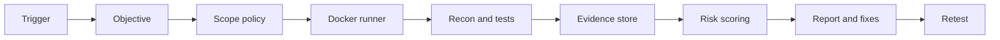

# Technical Architecture

Zurich Verity combines four building blocks:

1. **Validation triggers** from pull requests, main merges, scheduled scans, or manual security objectives.
2. **Smithers orchestration** for durable agent execution, retries, review gates, and step-level state.
3. **Docker runner** for active testing inside a controlled environment with explicit scope policy.
4. **Evidence and risk outputs** for developers, security teams, and leadership.

## Core Flow

## Production Shape

The prototype should become a CI/CD validation service rather than a one-off scanner. Teams define when Verity runs: on pull request, on merge to main, on release candidate, or on a schedule. The system keeps prior state so it can compare scans, focus on changed code, and avoid repeatedly testing unchanged surfaces.

## Engineering Principles

- Make scope explicit before any active testing.
- Prefer reproducible proof over unverified hypotheses.
- Store commands, responses, screenshots, logs, and timestamps for every confirmed finding.
- Separate raw evidence from curated reporting.
- Generate owner-ready output: affected asset, severity, exploit scenario, business risk, remediation, and retest command.
